 

  <h1 align="center">Projet SQL1</h1>
  <h6 align="center">Benjamin FONTANA</h6>

 

# A propos du projet

Ce projet est un projet de conception de base de données en ES au CPNV. Il conciste à créer une base de données pour un établissement de type ES. Le but est de nous apprendre à concevoir une base de données en posant les bonnes questions au client et en réfléchissant à la manière dont les données seront utilisées pour créer la base de données idéale pour notre client. C'est pourquoi le CDC est très peu détaillé, cela permet de pouvoir poser des questions sur les besoins. Vous trouverez plus d'information sur le projet dans la section [Analyse du projet](#analyse-du-projet). C'est là que les questions ont été dévelopées et analysées pour produire la base du MCD. À la fin de ce projet, il y'aura un MCD, un MLD et des scripts SQL pour créer la base de données et la peupler.

# Analyse du projet

Vous trouverez ci-après les besoins du client tiré des questions posées. Elles ont été reformulée pour être plus claires et plus précises. Les questions sont classées par thème.

Le client de ce projet est le prof ayant donné le cours, Monsieur [J. Ithurbide](https://github.com/jithurbide-CPNV).

## Horaires

Le plan de formation change tout les 2-3 ans, il faut donc garder un historique des cours.
Lors de la formation un planning trimestriel est établi et peut changer d'une année à une autre, il faut donc aussi garder un historique de ces plannings.
Cependant, les classes on un planning fix durant l'entièreté du trimestre.
Finalement, les notes sont organisées en semestre ainsi que les promotions. 

## Salles

Les salles de l'établissement sont répertoriées dans la base de données. Elle sont identifiées par un nom sous la forme `{Lieux abrégé}-{étage}{numéro de salle}`. Ainsi la 31ème salle du troisième étage du batiment de St-Croix sera nomée: `SC-331`

## Classes

Les classes sont composées d'élèves et d'un seul professeur principal. Les classes sont toujours dans la même salle et nous devons avoir un historique des salles de classes de chaques classes au cours des années.

 

## Elèves

Un élève est identifié par un `nom`, un `prénom`, une `date de naissance`, un `email`, un `téléphone`, une `adresse` et un `status` (En cours, Fini, Arrêté). Cela dit le status ne **doit pas** être `redoublant`. Cepedant si un élève arrête ou à fini sa formation, les notes de celui-ci sont conservées. Tout élève appartient à une seul branche (DEV, SYS, etc...) et à une seul classe. Il peut cependant changer de branche en cours de formation. Un ancien élève peut devenir prof, dans ce cas l'élève devient un prof mais concerve ses notes.

## Prof

Un prof est identifié par un `nom`, un `prénom`, une `date de naissance`, un `email`, un `téléphone`, une `adresse`, un `IBAN` et un `status`(En cours, Arrêt prolongé, Retraite). Les profs ne font pas parti d'une branche, mais peuvent enseigner à toutes les branches. Un prof peut être maître d'une classe mais ne peut pas en avoir plusieurs. Un prof peut enseigner plusieurs cours.

## Cours

Un cours est identifié par un `nom`, la ou les `filliaire(s)` dans laquelle il est enseigné, une `description`, le `trimestre`, le ou les `prof(s)` qui l'enseigne ou peuvent l'enseigner et les `notes` de celui ci. Un cours en composé par des périodes. Une période dure 45 minutes. Le cours peut être donnée par un seul prof en même temps(dans la même salle) mais plusieurs profs peuvent enseigner ce cours à des classes différentes. Un cour est toujours donné dans la même salle durant le trimestre.

## Notes

Les notes sont composées d'un `nom`, d'une `valeur` de 0 à 6 avec un coefficiant de 0.5(arondi au 0.5). Un cours peut avoir plusieurs notes, c'est pourquoi les notes ont un nom. Et les élèves qui redoublent leur année doivent garder les notes de l'année redoublée.

## Général

Les fillières de l'établissement doivent être renseignées et sont sujettes à changement. Les seules personnes qui seront répertoriée dans la base de données sont les élèves et les profs.

 
 
 
 
 
 
 
 
 
 
 
 
 

# Explications du MCD

Dans ce chapitre, vous trouverez les explications des choix de conception de la base de données. Les choix sont expliqués par entité.

## people_status

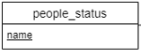

L'entité `people_status` contient les status que les personnes pourront avoir. On sait déjà que les status suivants devront y apparaitre: `élève`, `prof`, `en cours`, `arrêt prolongé`, `retraite`, `fini`, `arrêté`. Cependant, il est possible que d'autres status apparaissent, c'est pourquoi il est important de les stocker dans une table. À noté qu'aucun status `redoublant` n'a été mentionné puisque le client ne souhaite pas que les élèves ayent un tel status.

## people

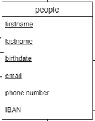

L'entité `people` répertorie les profs et les élèves. Ils ont tout en commun sauf l'IBAN. C'est pourquoi ils ont été regroupé en une seule entité. 

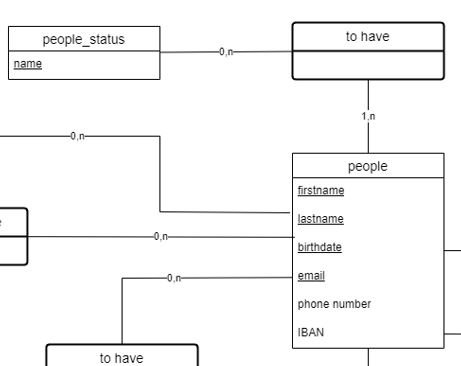

La relation entre `people` et `people_status` est une relation 1,n car une personne doit avoir au moins un status mais en aura sûrement plusieurs puisque nous avons un status élève ou prof plus leur status effectif(en cours, arrêt prolongé, etc...).

## addresses

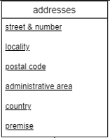

L'entité `addresses` n'a rien de spécial. Elle contient les adresses des personnes. Dans le cas où une adresse n'est pas liée a une personne, il faudra la supprimer. Ici un choix à été fait, en accord avec le client, pour que les personnes n'aie qu'une seule adresse.

## specialization

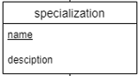

Cette entité répertories les branches de l'école. Elle contiendra pour l'instant les branches `DEV` et `SYS`. Cependant, il est possible que d'autres branches apparaissent, c'est pourquoi il est important de les stocker dans une table. Il y'a ausi la possibilité de renseigner une description de la branche si nécaissaire.

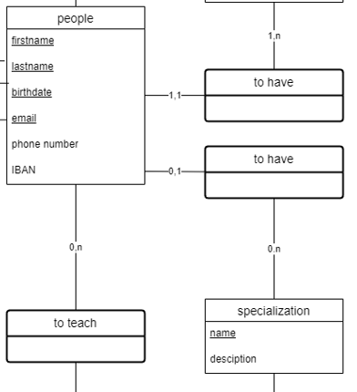

La relation entre `specialization` et `people` est une relation particulière. Un élève doit avoir une branche mais un prof non cela explique le 0,1 du côté `people`. Du côté `specialization` il y'a une relation 0,n qui s'explique par le fait qu'une branche peut être assignée a plusieur élève ou à aucun.

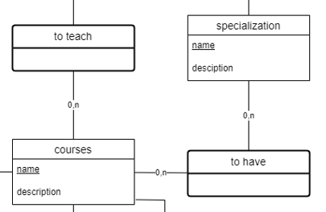

La relation entre `specialization` et `courses` permet de répertorier les cours liés aux branches. Cependant un cours peut ne pas être liée a une branche ou à plusieurs, c'est pourquoi la relation est 0,n. De même pour la spécialisation.

 
 
 
 
 

## courses

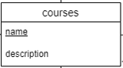

L'entité `courses` répertorie les cours de l'école. La relation passant par le verbe `to teach` est spécifique aux profs. En effet, un prof peut enseigner plusieurs cours et un cours peut être enseigné par plusieurs profs. Cependant, un cours ne peut pas être enseigné par plusieurs profs en même temps. Mais un cours peut ne pas être donné c'est pourquoi la relation est 0,n. De l'autre côté, la relation 0,n se justifie puisqu'un élève ne donne pas de cours.

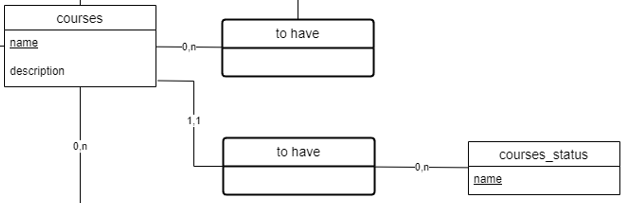

On peut constater que l'entité `courses` est lié à l'entité `courses_status`. Ce lien permet de savoir si le cours est donné ou non. Il a été externalisé dans une table externe car cela permettera de les mettre à jour au besoin. Acctuellement, la table possède ces quatres valeurs: `obselète`, `en cours`, `en révision` et `à réviser` .

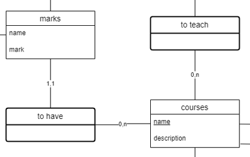

la relation `courses` et `marks` permet de répertorier les notes de chaques cours. Ici nous avons une relation 0,n car un cours peut autant ne pas avoir de notes puisqu'il n'est pas donné ou peut en avoir plusieurs. De l'autre côté une relation 1,1 est nécessaire puisqu'une note doit être liée à un cours.

 
 

## marks

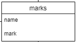

L'entité `marks` répertorie les notes. La relation `courses` et `marks` à été expliquée dans le [chapitre précédent](#courses).

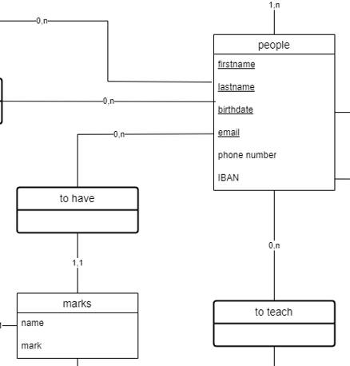

La relation `marks` et `people` permet de répertorier les notes des élèves. Ici nous avons une relation 0,n car un élève peut ne pas avoir de notes ou en avoir plusieurs. De l'autre côté une relation 1,1 est nécessaire puisqu'une note doit être liée à un élève.

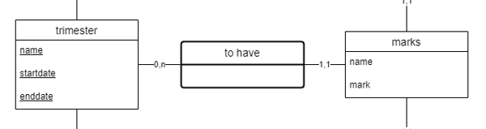

Et finalement la dernière relation des notes est celle `trimester` et `marks`. Dans cette relation, nous avons une relation 0,n car un trimestre peut ne pas avoir de notes ou en avoir plusieurs. De l'autre côté une relation 1,1 est nécessaire puisqu'une note doit être liée à un trimestre.

 
 

## trimester

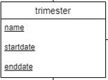

L'entité `trimester` répertorie les trimestres de l'école. La relation `trimester` et `marks` à été expliquée dans le [chapitre précédent](#marks).

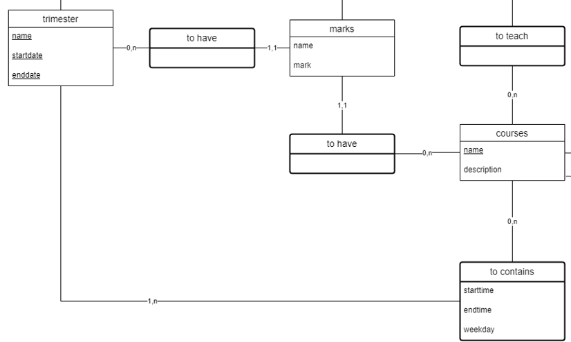

Ici une relation avec `courses` à été établie pour garder un historique des cours donnés durant les trimestres.

## classes

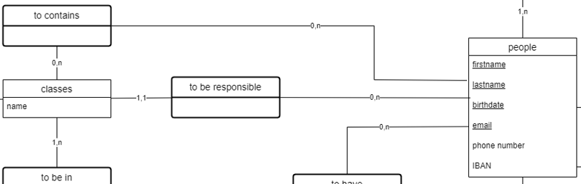

L'entité `classes` répertorie les classes de l'école. La relation `classes` et `people` est une double relation. En effet, une classe est composée d'élèves et d'un professeur principal. Cependant, un professeur peut être maître de classe mais ne peut pas en avoir plusieurs. C'est pourquoi la relation est 1,1 du côté `classes` -> `to be responsible` et 0,n de son sutre côté. Du côté `classes` -> `to contains` la relation est 0,n car une classe peut ne pas avoir d'élèves ou en avoir plusieurs et nous pouvons donc garder un historique de celles-ci. 

# Versions du MCD

## Version 1-3

Les versions 1 à 3 n'ont pas été sauvegardées mais n'étaient que des prototypes non fonctionnels.

## Version 4

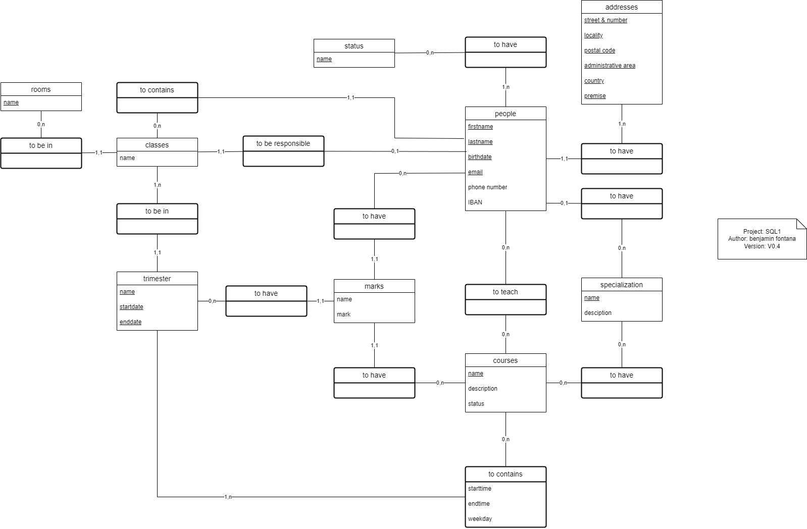

Cette version est la première version fonctionnelle. Une entité `status` à été créee pour l'entité `people`.

 
 
 
 
 
 
 
 
 

## Version 5

Dans la version 5, l'entité `status` à été renomée en `people_status` et une entité `courses_status` à été créee pour l'entité `courses` afin de généraliser la structure.

 
 
 
 
 
 
 
 
 
 
 
 
 
 
 
 
 
 
 
 
 

## Version 6

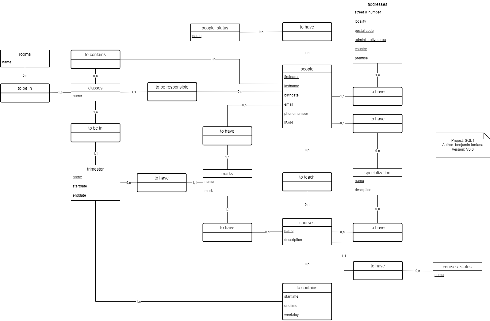

Dans la version 6, les relations entre `people` et `classes` ont été modifiées pour permettre de garder un historique des classes des élèves et de pouvoir résoudre les problèmes de génération du à une dépendence récursive.

# Spécification MLD

Le MLD doit être établi en fonction du MCD. Cepandant un ajout doit être fait pour les status et les enums. Dans ces cas là, il faut spécifier les valeurs de ces entités dans une table externe. C'est pourquoi les "entité" `people_status_values`, `courses_status_values` et `weekday_enum_values` ont été créées. Elles contiennent les valeurs connues des status et des enums.

 
 
 
 
 
 
 
 
 
 
 
 

# Versions du MLD

## Version 1

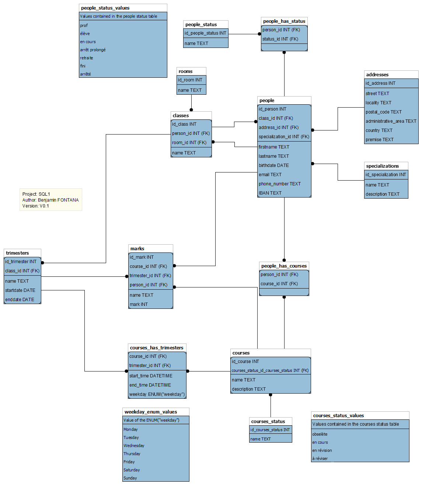

Dans cette version, le MLD est la traduction directe de la version 5 du MCD. Les entités `people_status_values`, `courses_status_values` et `weekday_enum_values` ont été créées pour spécifier les valeurs des status et des enums.

 
 
 
 

## Version 2

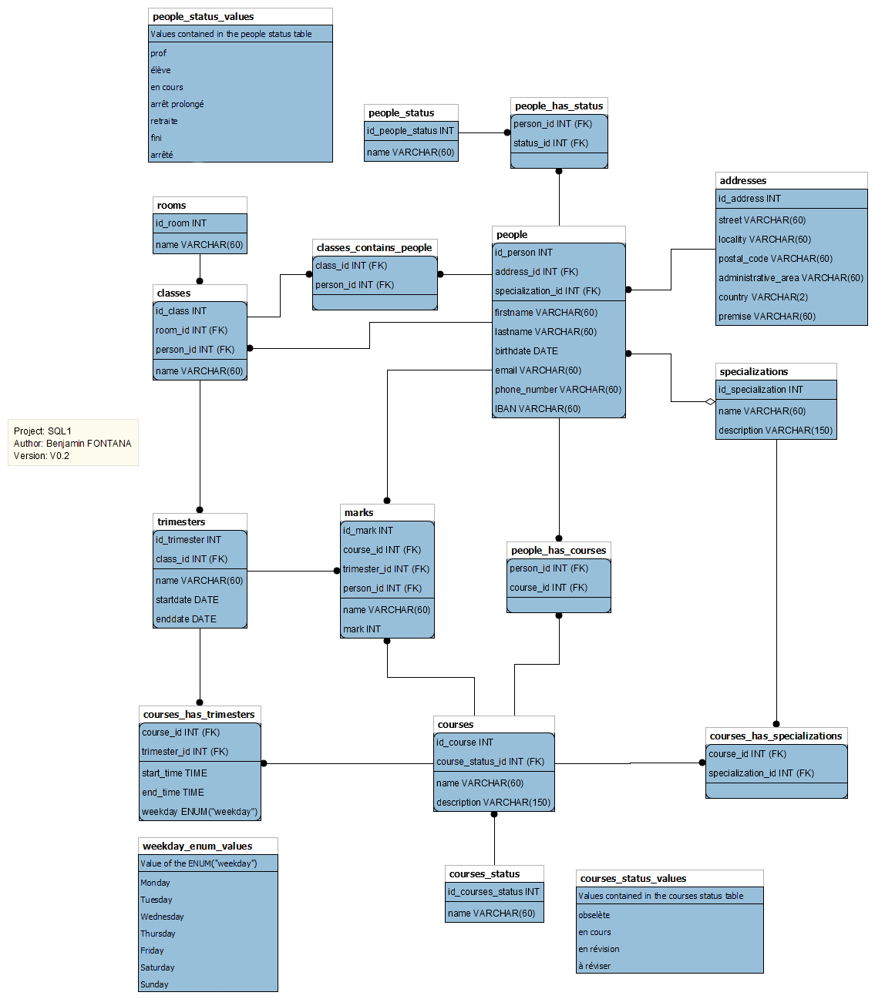

Dans cette version, le MLD est la traduction directe de la version 6 du MCD. Tout comme la version 1, les entités `people_status_values`, `courses_status_values` et `weekday_enum_values` ont été créées pour spécifier les valeurs des status et des enums.

 
 
 

## people_status_values

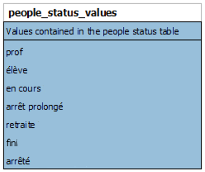

## courses_status_values

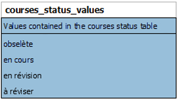

## weekday_enum_values

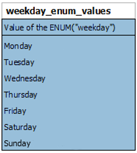

 
 

# Scripts SQL

## db_full_creation.sql

Ce script permet de créer la base de données. Il contient les instructions SQL pour créer la base de données, les tables, les relations et les inserts permettant de peupler la base de données.

## db_creation.sql

Ce script permet de créer la base de données. Il contient les instructions SQL pour créer la base de données et les tables.

## db_insert.sql

Ce script permet de peupler la base de données. Il contient les instructions SQL pour insérer des données dans les tables.

## test.sql

Ce script contient deux tests mettant à jour des valeurs de la base de données pour permettre de vérifier si un élève peut passer son année et si il peut aussi en redoubler une.

# Autheur

FONTANA Benjamin - <benjamin.fontana@eduvaud.ch>

Lien du projet: <https://github.com/R0kkxSynetique/SQL1>

> Date de création: 09.10.2023
>
> Dernière modification le 23.11.2023
